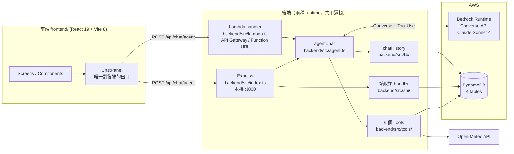

# LifePack — AI 生活打包工具

> 2026 雲湧智生：臺灣生成式 AI 應用黑客松

---

## 系統簡介

本提案以 **LifePack AI 生活打包工具**為核心，結合生成式 AI 與企業服務資源。使用者只需透過自然語言對話，
即可將餐廳訂位、叫車、購物與清潔修繕等跨領域需求一次打包，於單一介面完成多元操作。

首次使用時，系統透過輕量問答建立個人化偏好標籤。日常使用中，AI 可即時生成並儲存行程包，
並自動拆解為步驟清單，主動引導商品推薦與服務預約。技術上結合 AWS 與 Amazon Bedrock，
深度整合商品、門市與會員優惠，確保推薦精準且能落地執行。

對使用者而言，LifePack 將分散在不同 App 的操作收斂為一次對話，大幅降低決策成本；
對企業來說，能活化既有資產，提升跨服務轉換率與用戶黏著度，帶動主動式服務體驗。

### 核心價值

| 面向 | 說明 |
|---|---|
| 一次對話、跨域打包 | 訂位、叫車、購物、清潔修繕在同一個對話流程完成，不必切換 App |
| 個人化偏好標籤 | 首次輕量問答建立標籤，之後每次推薦都帶入 `get_user_profile` |
| 行程包自動拆解 | AI 產生行程包後自動拆成步驟清單，前端渲染為可執行的任務卡片 |
| 落地執行 | 推薦綁定真實商品、門市與價格資料，不是純文字建議 |

---

## 系統架構



完整技術架構說明見 [docs/architecture.md](./docs/architecture.md)。

### 兩種 runtime，一份邏輯

`index.ts`（Express）與 `lambda.ts`（Lambda）是**兩個入口、一份邏輯**，
兩者都直接呼叫 `agentChat()`，request / response 格式一致，前端只要換 URL 就能在本機與雲端間切換。

- **Express**：走路徑分流（`/api/chat/agent` 等）
- **Lambda**：走 HTTP method 分流，是否走 agent 看 `rawPath` 結尾是否為 `/agent`，
  或 body 帶 `agent: true`（支援沒有路徑層級的 Function URL）

### Agent Loop 單輪流程

1. **讀歷史** — 前端沒帶 `history` 時，從 DynamoDB `ChatHistory` 撈該 session 最新快照
2. **進 loop** — 呼叫 Bedrock Converse；`stopReason === "tool_use"` 就執行工具、把結果塞回 messages 再繼續
3. **結束** — 其他 `stopReason` 回傳文字；超過 `MAX_STEPS`（10）回降級訊息
4. **後處理** — `extractMission()` 把 `create_bundle` 結果轉成前端任務卡片，
   並用同一輪 `search_service` / `search_product` 的真實資料回填店名、價格、圖片
5. **存檔** — 整輪對話寫回 `ChatHistory`

---

## 技術棧

| 層級 | 技術 | 位置 |
|---|---|---|
| 前端 | React 19 + Vite 8 + TypeScript + Tailwind CSS 4 + `@iconify/react` | `frontend/` |
| 後端 | Node.js + TypeScript (ESM) + Express 5，以 `tsx` 直跑免編譯 | `backend/src/index.ts` |
| 後端（部署版） | AWS Lambda handler，與 Express 共用商業邏輯 | `backend/src/lambda.ts` |
| AI 引擎 | AWS Bedrock Converse API（Claude Sonnet 4） | `backend/src/agent.ts` |
| 線上資料庫 | AWS DynamoDB（4 張表，PAY_PER_REQUEST，`us-west-2`） | `backend/src/lib/dynamo.ts` |
| 離線資料庫 | PostgreSQL 16（Docker，主辦方 schema 對照用，**不在執行路徑上**） | `docker-compose.yml`、`db/` |
| 個資加密 | Node `crypto`（AES-256-GCM + SHA-256） | `src/crypto/` |
| 外部 API | Open-Meteo（天氣，免 API Key） | `backend/src/tools/getWeather.ts` |
| 測試 | Vitest 2 | `backend/src/lambda.test.ts` |
| 打包 | esbuild → 單檔 CJS bundle → zip | `npm run package:lambda` |
| 前端 Hosting | AWS Amplify（`amplify.yml`，appRoot `frontend/`） | `amplify.yml` |

> **線上跑的是 Bedrock + DynamoDB。** `db/` 底下的 PostgreSQL schema 是主辦方規格的對照實作，
> 沒有任何 runtime 程式碼讀它。

---

## AI Agent 工具

`executeTool()` 負責分發，`toolDefinitions` 是給 Converse API 的 schema。

| Tool | 作用 | 資料來源 |
|---|---|---|
| `get_user_profile` | 取偏好標籤，個人化推薦用 | DynamoDB `UserProfile` — Get |
| `search_service` | 找可預約服務 | DynamoDB `ServicesCatalog` — Scan + Filter(`category <> "product"`) |
| `search_product` | 找可購買商品 | DynamoDB `ServicesCatalog` — Scan + Filter(`category = "product"`) |
| `create_bundle` | 建行程包（產生前端任務卡片） | DynamoDB `UserLists` — Put(`TASK#`) |
| `create_order` | 建訂單草稿 | DynamoDB `UserLists` — Put(`ORDER#`) |
| `get_weather` | 查天氣與情境建議 | Open-Meteo API |

Bedrock 設定：Model `us.anthropic.claude-sonnet-4-20250514-v1:0`、Region `us-west-2`、
`MAX_STEPS` 10、`MAX_TOKENS` 2048、`temperature` 0.7、`MAX_HISTORY_MESSAGES` 24。

---

## 資料層

| Table | PK / SK | 用途 |
|---|---|---|
| `UserProfile` | `user_id` | 偏好、hashtag 標籤 |
| `UserLists` | `user_id` / `list_type_id` | 用 SK prefix 區分：`CART#current`、`TASK#<id>`、`ORDER#<id>` |
| `ServicesCatalog` | `vendor_id` / `service_id` | 服務與商品同表，靠 `category` 區分 |
| `ChatHistory` | `session_id` / `timestamp` | 每輪對話新增一筆快照，讀取取最新一筆 |

設計原則是「相同查詢入口的資料放同一張表，用 SK prefix 區分類型」——
DynamoDB 不能 JOIN，分表會讓一個頁面要打多次 query。完整欄位定義見 [docs/DATABASE.md](./docs/DATABASE.md)。

Service type 代碼：
1 一般居家清潔 / 2 家電清洗 / 3 包裹寄送 / 6 餐廳訂位 / 9 美食外送 / 10 水電修繕 / 11 商城購物。

---

## API Endpoints

| Method | Path | 說明 |
|---|---|---|
| GET | `/health` | 健康檢查 |
| POST | `/api/chat` | 單句問答（InvokeModel） |
| POST | `/api/chat/messages` | 多輪對話（帶完整歷史） |
| POST | `/api/chat/agent` | **主力** Agent Loop |
| GET | `/api/profile/:userId` | 使用者偏好標籤 |
| GET | `/api/bundles/:userId` | 行程包列表 |
| GET | `/api/cart/:userId` | 購物車 |
| GET | `/api/orders/:userId` | 訂單列表 |

### Agent 請求 / 回應

```jsonc
// POST /api/chat/agent
{
  "userId": "usr_jamie_888",
  "message": "幫我安排週末的家庭聚餐",
  "history": []
}
```

```jsonc
{
  "reply": "已幫你打包好週末聚餐行程...",
  "history": [],
  "mission": {},      // 行程包任務卡片（有呼叫 create_bundle 時才有）
  "toolCalls": [],    // 本輪呼叫過的工具
  "sessionId": "..."
}
```

錯誤格式統一為 `{ "error": "描述", "detail": "細節" }`。
完整需求清單見 [docs/api-endpoints.md](./docs/api-endpoints.md)。

---

## 目錄結構

```
2026_AI_Hackathon_Team4/
├── backend/src/
│   ├── index.ts           # Express server (API routes)
│   ├── lambda.ts          # Lambda handler (部署用)
│   ├── agent.ts           # Bedrock Agent Loop (tool use)
│   ├── bedrock.ts         # Bedrock client 封裝
│   ├── api/               # 讀取類 handler
│   ├── lib/               # dynamo.ts / chatHistory.ts
│   └── tools/             # 6 個 Agent Tools
├── frontend/src/
│   ├── App.tsx            # 12 個 screens，用 state 切換（無 router）
│   ├── components/        # ChatPanel / ContextPanel / TaskDetail 等 6 個
│   ├── data.ts            # 情境包模板
│   └── types.ts
├── db/                    # 主辦方規格參考 (PostgreSQL DDL + seed JSON)
├── docs/                  # architecture / DATABASE / api-endpoints / prd
├── src/crypto/            # AES-256-GCM 加密工具
└── amplify.yml            # 前端 Amplify 部署設定
```

---

## 快速開始

### 1. 安裝依賴

```bash
npm install
cd frontend && npm install && cd ..
```

### 2. 設定環境變數

```bash
cp .env.example .env
```

填入以下值（從 Workshop Studio 的 "Get AWS CLI credentials" 取得）：

```env
AWS_REGION=us-west-2
AWS_ACCESS_KEY_ID=ASIA...
AWS_SECRET_ACCESS_KEY=...
AWS_SESSION_TOKEN=...
BEDROCK_MODEL_ID=us.anthropic.claude-sonnet-4-20250514-v1:0
```

### 3. 啟動後端

```bash
npm run dev          # Express + tsx watch，跑在 http://localhost:3000
```

### 4. 啟動前端

開另一個 terminal：

```bash
cd frontend && npm run dev    # 跑在 http://localhost:5173
```

前端環境變數（`frontend/.env.local`）：

| 變數 | 預設 | 說明 |
|---|---|---|
| `VITE_API_BASE` | `http://localhost:3000` | Express 位址 |
| `VITE_AGENT_URL` | `${VITE_API_BASE}/api/chat/agent` | 要打部署好的 Lambda 就整條換掉 |
| `VITE_USER_ID` | `usr_jamie_888` | 必須對得上 `UserProfile` 表裡實際存在的 id |

### 5. 測試

在前端聊天框輸入「幫我安排週末的家庭聚餐」，觀察：

- 前端跑「AI 正在規劃中」動畫，接著渲染任務卡片
- 後端 terminal 印出 `[Agent] 使用工具: search_service {...}`

---

## 部署

| 項目 | 現況 |
|---|---|
| 後端 | esbuild bundle 成單檔 CJS（`dist-lambda/index.js`）→ zip → 上傳 Lambda |
| 對外入口 | API Gateway HTTP API 或 Lambda Function URL（handler 兩種都支援） |
| 前端 | AWS Amplify，push 到 `main` 自動建置（`amplify.yml`，appRoot `frontend/`） |
| DynamoDB | 手動建表，`db:seed:services` 灌目錄資料 |
| IaC | 無（沒有 Terraform / CDK / SAM） |

```bash
npm run build:lambda         # esbuild bundle
npm run package:lambda       # bundle + zip
npm test                     # vitest run
npm run db:up / db:migrate / db:seed / db:seed:services / db:reset
```

---

## 團隊分工

| 角色 | 負責內容 |
|---|---|
| 資料庫後端 | DynamoDB table 設計、seed 資料、Tool 串接實作 |
| AI 智能回覆 | Bedrock Agent Loop、System Prompt、Tool 定義 |
| 前端 | React UI、聊天介面、行程包展示 |
| 簡報/架構 | 系統架構圖、demo 腳本、投影片 |

---

## 注意事項

- Workshop Studio 的 credentials **會過期**，過期後需重新取得並更新 `.env`
- `.env` 已列入 `.gitignore`，不會進 git
- 所有服務商名稱皆為虛擬名稱，不使用真實品牌
- 不做真實金流模擬，訂單狀態以文字說明呈現
- Demo 階段所有 endpoint **皆無身分驗證**，`userId` 直接從 request body 取得；
  其餘已知安全缺口見 [docs/architecture.md](./docs/architecture.md#9-安全現況與已知缺口)
