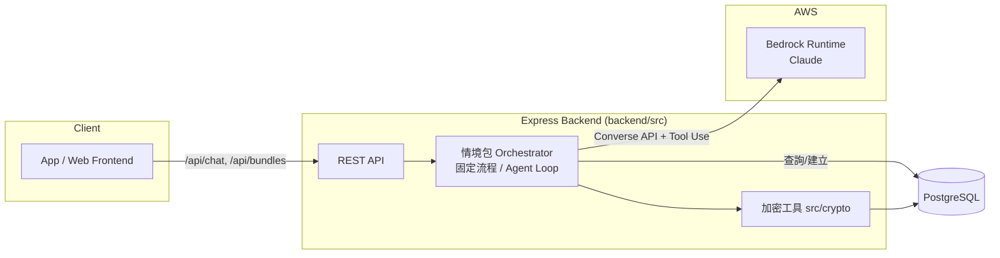

# 技術架構文件 (Technical Architecture)

> 對應 [prd.md](../prd.md) 之技術實作規劃，現況以本文件與程式碼為準。

## 1. 技術棧

| 層級 | 技術 | 說明 |
|---|---|---|
| 前端 | `frontend/`（Vite build） | iOS/Android App 或 Web Demo |
| 後端 | Node.js 22 + TypeScript + Express（`backend/src`） | `tsx` 直接執行，免額外編譯 |
| 資料庫 | PostgreSQL 16（本地 Docker，未來 AWS RDS） | `db/schema` 建表，`db/scripts` 匯入/管理 |
| AI 引擎 | AWS Bedrock（Claude, `@aws-sdk/client-bedrock-runtime`） | 對話理解、情境包生成、任務拆解 |
| 個資加密 | Node `crypto` 原生模組（AES-256-GCM + SHA-256） | `src/crypto/` |
| 測試 | Vitest | |

## 2. 整體架構



## 3. 資料庫層

已建表（`db/schema/`，依檔名順序執行）：

| 資料表 | 用途 |
|---|---|
| `sys_county` / `sys_district` | 縣市/行政區代碼 |
| `cms_homepage_service_vendor` | 服務商主檔（虛擬品牌名） |
| `cms_homepage_service` | 服務項目，依 `type` 分類（1清潔/2家電清洗/3寄件/6訂位/9外送/10水電修繕/11購物） |
| `pms_form` / `pms_form_group` / `pms_form_topic` / `pms_topic_option` / `pms_form_feedback` | 動態問答表單，`pms_form_feedback` 存加密後的個資回覆 |
| `mms_order_record` | 統一訂單紀錄，`vendor_data` / `order_items` 為 JSONB，個資欄位加密存 `bytea` |

PRD 中「情境包 / Hashtag 標籤 / 使用者 Profile / AI 步驟拆解進度」尚未有對應資料表，屬 Phase 4 待補設計。

## 4. AI 整合層（Bedrock）

### 4.1 現況

`backend/src/bedrock.ts` 用 `InvokeModelCommand` 直接呼叫 Claude（Anthropic 原生 request/response 格式），`backend/src/index.ts` 暴露：

- `POST /api/chat`：單句問答
- `POST /api/chat/messages`：帶完整對話歷史的多輪對話

認證：`.env` 內 `AWS_REGION` / `AWS_ACCESS_KEY_ID` / `AWS_SECRET_ACCESS_KEY` / `BEDROCK_MODEL_ID`，部署後改用 IAM Role。

### 4.2 依情境複雜度分三種呼叫模式

對應 [prd.md](../prd.md) 第 3 節三層架構：

| PRD 層級 | 呼叫模式 | 說明 |
|---|---|---|
| 第二層：預設情境包 | **固定流程**（程式碼寫死步驟順序） | 呼叫 Bedrock 只做 Tool Use 結構化參數填值，不做多步決策，省 token |
| 第三層：臨時任務 / 自訂情境包 | **Agent Loop**（Converse API + tool-use，模型自行決定呼叫順序與次數） | 步驟數量/順序不固定，如「今天下班幫我買生日蛋糕」需動態查詢 vendor、地點、時段 |
| 表單問答（水電修繕等） | **多輪對話**（`messages` 累積歷史） | 依 `pms_form_topic` 逐題收集，非 agent，只是有狀態的對話 |

### 4.3 Tool Use 對應的工具（規劃）

```
search_vendor        -- 依 type 查 cms_homepage_service_vendor / cms_homepage_service
search_form_topics   -- 查詢 pms_form_topic，取得表單題目
fill_form_answer     -- 填入使用者對某題的回答 -> pms_form_feedback
create_order_draft   -- 建立訂單草稿（未確認，不寫入 mms_order_record）
confirm_order        -- 使用者確認後才寫入 mms_order_record
check_weather         -- PRD 5.2 天氣感知（外部 Weather API）
```

Agent Loop 需設 `MAX_STEPS` 上限防止無限迴圈；訂單一律先建草稿，經使用者確認才落地，避免自訂情境包未經同意就建立訂單。

## 5. 安全與合規

- 個資欄位（姓名/電話/Email/地址）一律 AES-256-GCM 加密存 `bytea`，`*_hash` 欄位存 SHA-256 供比對查詢（見 [README.md](../README.md#個資加密設計)）。
- 黑客松規則：所有服務商/服務名稱須為自創虛擬名稱，PRD 草稿中出現的真實品牌（yoxi、CITY CAFE、7-11、foodomo、Klook、ibon、博客來等）於實作前需替換。
- 不做真實金流模擬，訂單狀態以文字說明呈現（`mms_order_record.remark`）。

## 6. 部署規劃（Phase 5）

- 後端：容器化後部署至 AWS（ECS/App Runner 待定），透過 IAM Role 呼叫 Bedrock，免明碼金鑰。
- 資料庫：本地 Docker Postgres → AWS RDS。
- Bedrock：需確認目標 region 已開通所選 Claude 模型存取權限（Bedrock console 申請），新版模型可能需 inference profile ARN 而非單純 model ID。
