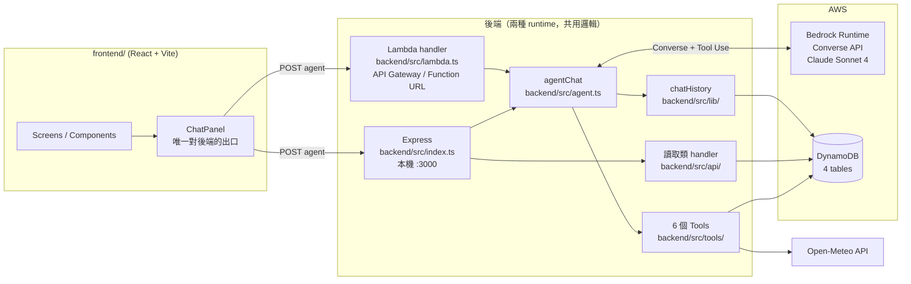

# 技術架構文件 (Technical Architecture)

> 本文件記錄**現況**（以程式碼為準）。需求層面的規劃見 [prd.md](./prd.md)，
> API 的目標規格見 [api-endpoints.md](./api-endpoints.md)（該文件是需求清單，非已實作清單）。
> 資料庫細節見 [DATABASE.md](./DATABASE.md)。

---

## 1. 技術棧

| 層級 | 技術 | 位置 |
|---|---|---|
| 前端 | React 19 + Vite 8 + TypeScript + Tailwind CSS 4 + `@iconify/react` | `frontend/` |
| 後端 | Node.js + TypeScript (ESM) + Express 5，以 `tsx` 直跑免編譯 | `backend/src/index.ts` |
| 後端（部署版） | AWS Lambda handler，與 Express 共用同一份商業邏輯 | `backend/src/lambda.ts` |
| AI 引擎 | AWS Bedrock Converse API（Claude Sonnet 4） | `backend/src/agent.ts` |
| 線上資料庫 | AWS DynamoDB（4 張表，PAY_PER_REQUEST，`us-west-2`） | `backend/src/lib/dynamo.ts` |
| 離線資料庫 | PostgreSQL 16（Docker，僅供主辦方 schema 與 seed 驗證，**不在執行路徑上**） | `docker-compose.yml`、`db/` |
| 個資加密 | Node `crypto`（AES-256-GCM + SHA-256），目前只在 Postgres seed 使用 | `src/crypto/` |
| 外部 API | Open-Meteo（天氣，免 API Key） | `backend/src/tools/getWeather.ts` |
| 測試 | Vitest 2 | `backend/src/lambda.test.ts`、`src/crypto/crypto.test.ts` |
| 打包 | esbuild → 單檔 CJS bundle → zip | `npm run package:lambda` |

**重點：線上跑的是 Bedrock + DynamoDB。** `db/` 底下的 PostgreSQL schema 是主辦方規格的對照實作，
目前沒有任何 runtime 程式碼讀它（`pg` 只被 `db/scripts/` 使用）。

---

## 2. 整體架構



### 兩種 runtime 的關係

`index.ts`（Express）與 `lambda.ts`（Lambda）是**兩個入口、一份邏輯**：
兩者都直接呼叫 `agentChat()`、`bedrock.ts`，request/response 格式保持一致，
前端只要換 URL 就能在本機與雲端之間切換。

- Express：走路徑分流（`/api/chat/agent` 等）
- Lambda：走 HTTP method 分流（`OPTIONS` preflight / `GET` 掃表 / `POST` 聊天），
  是否走 agent 看 `rawPath` 結尾是否為 `/agent`，或 body 帶 `agent: true`
  （為了支援沒有路徑層級的 Function URL / 單一路徑 API Gateway）

---

## 3. AI 整合層（Bedrock）

### 3.1 主要路徑：Agent Loop（`backend/src/agent.ts`）

用 `ConverseCommand` + `toolConfig` 實作，Claude 自行決定呼叫哪些工具、呼叫幾次。

| 設定 | 值 | 來源 |
|---|---|---|
| Model ID | `us.anthropic.claude-sonnet-4-20250514-v1:0` | `BEDROCK_MODEL_ID`，需 inference profile 格式（`us.` 前綴） |
| Region | `us-west-2` | `AWS_REGION` |
| `MAX_STEPS` | 10（每步 = 一次 Bedrock 呼叫） | 防無限迴圈 |
| `MAX_TOKENS` | 2048 | |
| `temperature` | 0.7 | |
| `MAX_HISTORY_MESSAGES` | 24 | 控制 token 成長 |
| `MAX_TOOL_RESULT_CHARS` | 4000 | 單一工具結果超過就截斷 |

單輪流程：

1. 讀歷史 — 前端沒帶 `history` 時，從 DynamoDB `ChatHistory` 撈該 session 最新快照
2. 進 loop — 呼叫 Converse；`stopReason === "tool_use"` 就執行工具、把結果塞回 messages 再繼續
3. 結束 — 其他 `stopReason` 就回傳文字；超過 `MAX_STEPS` 回固定的降級訊息
4. 後處理 — `extractMission()` 把 `create_bundle` 結果轉成前端任務卡片，
   並用同一輪 `search_service` / `search_product` 的真實資料回填店名、價格、圖片
5. 存檔 — 整輪對話寫回 `ChatHistory`，寫失敗只記 log 不影響回覆

兩個實作上的細節值得知道：

- `trimHistory()` 只在「使用者的純文字訊息」邊界切歷史，否則會拆散 `toolUse` 與 `toolResult` 的配對，Bedrock 會直接報錯。
- `stripMarkdown()` 是保險機制 — 模型偶爾不遵守「禁止 Markdown」的指示，前端會顯示星號原文，所以在後端再清一次。

### 3.2 次要路徑：`backend/src/bedrock.ts`

較早期的實作，用 `InvokeModelCommand` + Anthropic Messages API 原生格式，
支撐 `/api/chat` 與 `/api/chat/messages` 兩個簡易 endpoint。前端目前不走這條。

> 已知不一致：`bedrock.ts` 的 region 預設值是 `us-east-1`、model 預設值是 Claude 3 Sonnet，
> 與 `agent.ts` 的 `us-west-2` / Sonnet 4 不同。有 `.env` 時不影響，缺環境變數時行為會分岔。

### 3.3 Tools（`backend/src/tools/`）

`executeTool()` 負責分發，`toolDefinitions` 是給 Converse API 的 schema。

| Tool | 作用 | 資料來源 |
|---|---|---|
| `get_user_profile` | 取偏好標籤，個人化推薦用 | DynamoDB `UserProfile` — Get |
| `search_service` | 找可預約服務 | DynamoDB `ServicesCatalog` — Scan + Filter(`category <> "product"`) |
| `search_product` | 找可購買商品 | DynamoDB `ServicesCatalog` — Scan + Filter(`category = "product"`) |
| `create_bundle` | 建行程包（產生前端任務卡片） | DynamoDB `UserLists` — Put(`TASK#`) |
| `create_order` | 建訂單草稿 | DynamoDB `UserLists` — Put(`ORDER#`) |
| `get_weather` | 查天氣與情境建議 | Open-Meteo API，內建城市座標表，失敗回 fallback |

`search_service` 有個補救邏輯：`type` 是模型自己猜的（它只看得到系統提示列的 7 種代碼），
遇到目錄裡沒有的分類（例如「搬家」常被誤猜成 `3`）會把關鍵字明明對得上的結果濾光，
所以查不到時會退回「只用關鍵字」再查一次。

---

## 4. 資料層

### 4.1 DynamoDB（線上）

| Table | PK / SK | 用途 |
|---|---|---|
| `UserProfile` | `user_id` | 偏好、hashtag 標籤 |
| `UserLists` | `user_id` / `list_type_id` | 用 SK prefix 區分：`CART#current`、`TASK#<id>`、`ORDER#<id>` |
| `ServicesCatalog` | `vendor_id` / `service_id` | 服務與商品同表，靠 `category` 區分 |
| `ChatHistory` | `session_id` / `timestamp` | 每輪對話新增一筆快照（非覆蓋），讀取取最新一筆 |

設計原則是「相同查詢入口的資料放同一張表，用 SK prefix 區分類型」——
因為 DynamoDB 不能 JOIN，分表會讓一個頁面要打多次 query。完整欄位定義見 [DATABASE.md](./DATABASE.md)。

`ChatHistory` 存兩份歷史：`dialog_history`（純文字，給人看）與
`raw_history`（Bedrock content block 的 JSON 字串，含 toolUse/toolResult，用於續接對話）。
`raw_history` 超過 300KB 就只留純文字，避免撞到 DynamoDB 單筆 400KB 上限。

### 4.2 PostgreSQL（離線 / 對照用）

`db/schema/` 依檔名順序執行：

| 資料表 | 用途 |
|---|---|
| `sys_county` / `sys_district` | 縣市、行政區代碼 |
| `cms_homepage_service_vendor` | 服務商主檔（虛擬品牌名） |
| `cms_homepage_service` | 服務項目，依 `type` 分類 |
| `pms_form` / `pms_form_group` / `pms_form_topic` / `pms_topic_option` / `pms_form_feedback` | 動態問答表單 |
| `mms_order_record` | 統一訂單紀錄，JSONB + 加密 `bytea` 欄位 |

Service type 代碼（`ServicesCatalog` 沿用同一套）：
1 一般居家清潔 / 2 家電清洗 / 3 包裹寄送 / 6 餐廳訂位 / 9 美食外送 / 10 水電修繕 / 11 商城購物。

腳本（`db/scripts/`）：`migrate` 建表、`seed` 匯入範例資料（含 AES-256-GCM 加密個資）、
`seed-services-catalog` 灌 DynamoDB 目錄、`reset` 重置、`check-image-urls` 檢查圖片連結。

---

## 5. 已實作的 API

以 `backend/src/index.ts` 為準（Lambda 版只暴露 chat / agent 與 GET 掃表）：

| Method | Path | 說明 |
|---|---|---|
| GET | `/health` | 健康檢查 |
| POST | `/api/chat` | 單句問答（InvokeModel） |
| POST | `/api/chat/messages` | 多輪對話（帶完整歷史） |
| POST | `/api/chat/agent` | **主力** Agent Loop，回 `{ reply, history, mission, toolCalls, sessionId }` |
| GET | `/api/profile/:userId` | 使用者偏好標籤（與 AI 看到的同一份） |
| GET | `/api/bundles/:userId` | 行程包列表 |
| GET | `/api/cart/:userId` | 購物車 |
| GET | `/api/orders/:userId` | 訂單列表 |

錯誤格式統一為 `{ "error": "描述", "detail": "細節" }`。
[api-endpoints.md](./api-endpoints.md) 列的是完整需求清單，其中寫入類（購物車 CRUD、
訂單建立、對話管理、靜態模組）目前只透過 Bedrock tool 間接完成，尚無獨立 REST endpoint。

---

## 6. 前端

- 入口 `main.tsx` → `App.tsx`，用 state 切換畫面，沒有 router
- 12 個 screens：`Home`、`Login`、`Onboarding`、`Missions`、`MissionWorkspace`、`MissionComplete`、
  `AIPlanning`、`ScenarioPackDetail`、`Shopping`、`Cart`、`Profile`、`Recommendations`
- 6 個 components：`ChatPanel`、`ContextPanel`、`AIAssistant`、`Sidebar`、`BottomNav`、`TaskDetail`
- **`ChatPanel.tsx` 是唯一對後端發 request 的地方**，所有使用者輸入一律交給 agent
  （包含情境卡片，會被轉成 `SCENARIO_PROMPTS` 裡的自然語言再送出）
- 對話歷史存在 `agentHistory` ref，每輪帶回後端維持上下文
- 收到 `toolCalls` 會跑「AI 正在規劃中」的分析動畫，收到 `mission` 則渲染任務卡片

環境變數（`frontend/.env.local`）：

| 變數 | 預設 | 說明 |
|---|---|---|
| `VITE_API_BASE` | `http://localhost:3000` | Express 位址 |
| `VITE_AGENT_URL` | `${VITE_API_BASE}/api/chat/agent` | 要打部署好的 Lambda 就整條換掉 |
| `VITE_USER_ID` | `usr_jamie_888` | 必須對得上 `UserProfile` 表裡實際存在的 id，否則個人化失效 |

---

## 7. 環境變數（`.env`）

```
DB_HOST / DB_PORT / DB_USER / DB_PASSWORD / DB_NAME   # PostgreSQL（本機）
PII_ENCRYPTION_KEY                                     # AES-256-GCM, 32 bytes base64
AWS_REGION / AWS_ACCESS_KEY_ID / AWS_SECRET_ACCESS_KEY / AWS_SESSION_TOKEN
BEDROCK_MODEL_ID
DYNAMO_USER_PROFILE_TABLE / DYNAMO_USER_LISTS_TABLE
DYNAMO_SERVICES_TABLE / DYNAMO_CHAT_HISTORY_TABLE
```

Workshop Studio 的 credentials 有時效，`AWS_SESSION_TOKEN` 過期需重新取得。
`.env` 不進 git。

---

## 8. 部署現況

| 項目 | 現況 |
|---|---|
| 後端 | esbuild bundle 成單檔 CJS（`dist-lambda/index.js`）→ zip → 手動上傳 Lambda |
| 對外入口 | API Gateway HTTP API 或 Lambda Function URL（handler 兩種都支援） |
| 前端 | `vite build` → `frontend/dist`，**hosting 尚未設定** |
| DynamoDB | 手動建表（無建表腳本），`seed-services-catalog` 灌目錄資料 |
| IaC | 無（沒有 Terraform / CDK / SAM / CloudFormation） |
| 容器 | 無 Dockerfile；`docker-compose.yml` 只跑本機 Postgres |

指令：

```bash
npm run dev                  # Express + tsx watch
npm run build:lambda         # esbuild bundle
npm run package:lambda       # bundle + zip
npm test                     # vitest run
npm run db:up / db:migrate / db:seed / db:seed:services / db:reset
```

---

## 9. 安全現況與已知缺口

已做：

- 個資（姓名/電話/Email/地址）在 Postgres 側以 AES-256-GCM 加密存 `bytea`，
  `*_hash` 存 SHA-256 供比對查詢（`src/crypto/`）
- 工具結果與對話歷史都有大小上限，避免 token 與 DynamoDB item 爆量
- 訂單與行程包一律先建草稿，系統提示要求模型先向使用者確認品項與價格
- 服務商與服務名稱皆為自創虛擬名稱（黑客松規則）

已知缺口（Demo 階段可接受，正式化前需處理）：

- **所有 endpoint 皆無身分驗證**，`userId` 直接從 request body 取得，可任意冒用他人資料
- Lambda 的 CORS 是 `Access-Control-Allow-Origin: *`，有正式網域後應收斂
- DynamoDB 側的資料未加密（`UserProfile` 的 email 等欄位是明碼）
- `search_service` / `search_product` 用 Scan 全表掃，資料量放大後成本與延遲會惡化
- 憑證仍走 access key，部署後應改用 Lambda 的 IAM Role
- 無金流，訂單狀態以文字呈現
